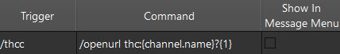
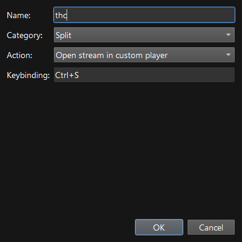

A minimal [twitch-hls-client](https://github.com/2bc4/twitch-hls-client) wrapper process for registering a Windows OS URI protocol. The main intention's for use with programs which call URI protocols, in my case, [chatterino2](https://github.com/Chatterino/chatterino2).

## Installation

```pwsh
scoop bucket add dank-scoop https://github.com/brian6932/dank-scoop
scoop install dank-scoop/twitch-hls-client-uri-protocol
```

## Chatterino usage

Within chatterino2, there are 2 ways to accomplish this, and they both rely on this protocol. First, open the settings menu (<kbd>CTRL</kbd>+<kbd>P</kbd>).

| Split input box (`/command`)                                                                                                                                                                             | Custom player (split header & hotkey)                                                                                                                                                                                            |
|:---------------------------------------------------------------------------------------------------------------------------------------------------------------------------------------------------------|:---------------------------------------------------------------------------------------------------------------------------------------------------------------------------------------------------------------------------------|
| Go to the `Commands` tab, and register a new command.                                                                                                                                                    | Go to the `External tools` tab, and edit the `Custom stream player URI Scheme` setting.                                                                                                                                          |
| `/thc <channel> [quality]`                                                                                                                                             |                                                                                                                                                                                         |
| `/thcc [quality]`                                                                                                                                      | Each tab's made up of splits, and each split has a header with the channel name. Right-click on that header. <br/>Alternatively, add a hotkey in the `Hotkeys` tab.  |
| You can provide arguments as query parameters (e.g. opening a stream which you don't have open as a split), and make multiple commands for different configs (you can't do this with the custom player). | You can use your mouse or set a hotkey (you can't do this with /commands).                                                                                                                                                       |

## Protocol registration info
When registering protocols within the Windows Registry, there's a user-scoped path (`HKEY_CURRENT_USER\Software\Classes`), and a system-scoped path (`HKEY_CLASSES_ROOT`). They require the same directory + key layout, and neither use your `User` Path environment variable without spawning processes, full paths are basically required in the `shell\open\command\(Default)` key's value. More info about how this works [here](https://github.com/brian6932/dank-scoop/blob/master/bucket/twitch-hls-client-uri-protocol.json).
