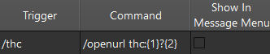
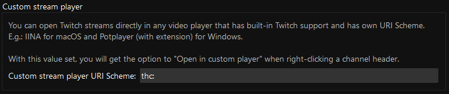
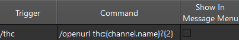
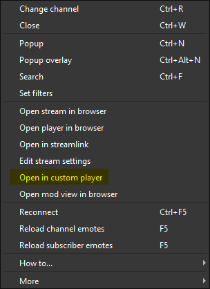

A minimal wrapper over [twitch-hls-client](https://github.com/2bc4/twitch-hls-client) for registering it as a Windows OS URI protocol. The main intention's for use with programs which call URI protocols, in my case, [chatterino2](https://github.com/Chatterino/chatterino2). Within chatterino2, there are 2 ways to accomplish this which both rely on this protocol.

## Chatterino usage

First, open the settings menu (<kbd>CTRL</kbd>+<kbd>P</kbd>).

| /command                                                                                                                   | split header                                                                            |
|:---------------------------------------------------------------------------------------------------------------------------|:----------------------------------------------------------------------------------------|
| Go to the `Commands` tab, and register a new command.                                                                      | Go to the `External tools` tab, and edit the `Custom stream player URI Scheme` setting. |
|                                                                                                                            |                                                                                         |
|  `/thc <channel> [quality]`                                                              |                                                |
|  `/thc [channel] [quality]`                                             |                                                        |
|                                                                                                                            |                                                                                         |
| The benefit of this method's that you can provide arguments as query parameters, you can't do this with the custom player. | The benefit of this method's that you can use your mouse.                               |

## Protocol registration info
When registering protocols within the Windows Registry, there's a user-scoped path (`HKEY_CURRENT_USER\Software\Classes`), and a system-scoped path (`HKEY_CLASSES_ROOT`). They require the same directory + key layout, and neither use your `User` Path environment variable without spawning processes, full paths are basically required in the `shell\open\command\(Default)` key's value.
